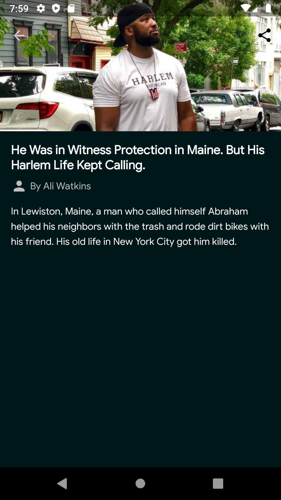
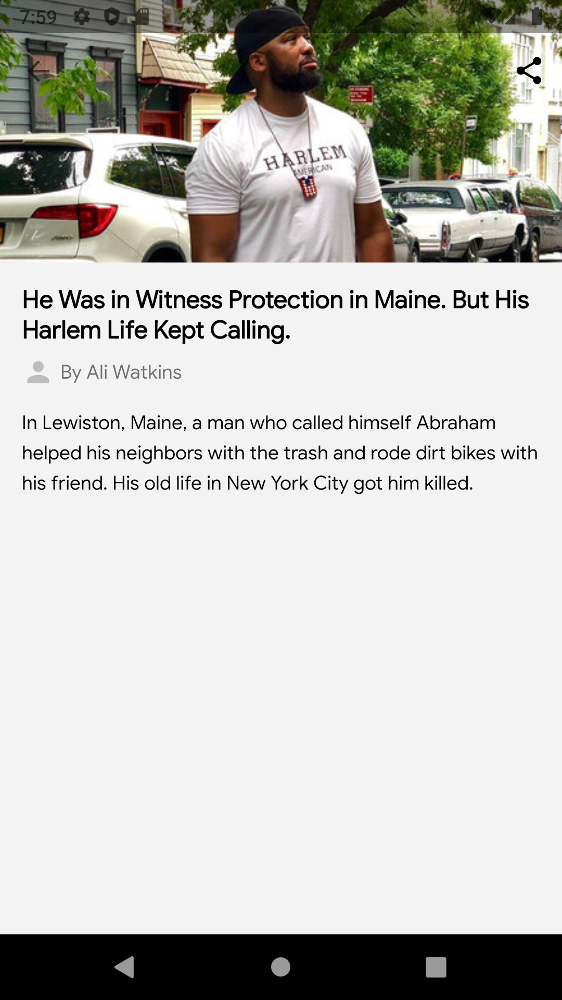

# MostViewedNYTimesArticles
## About
A simple app to hit the NY Times Most Popular Articles API and show a list of articles, that shows details when items on the list are tapped (a typical master/detail app).

#Installation
Requirement:
* Any Operating System (i.e MacOS X, Linux, Windows)
* An IDE (Android Studio) - [download](https://developer.android.com/studio)

* Most Popular API from [nytimes developer](https://developer.nytimes.com/apis) have been used.

* For example: https://api.nytimes.com/svc/mostpopular/v2/mostviewed/all-sections/7.json?api-key=yourkey

* Where your_key has to be generated following [get-started](https://developer.nytimes.com/get-started) page from nytimes.

* Clone the repo

* make changes to build:gradle (:app) by changing the `API_KEY` to your own API_KEY in buildTypes (buildConfigField)

 

    
    
    
    

 

## The app has following packages:
1. **data**: It contains all the data accessing, repositories and manipulating components.
2. **di**: Dependency providing classes using Hilt.
3. **model**: It contains data classes and or models.
4. **ui**: View classes along with their corresponding ViewModels.
5. **utils**: Utility classes.
#### Classes have been designed in such a way that it could be inherited and maximize the code reuse.
 

## Library reference resources:
1. Coroutines: https://codelabs.developers.google.com/codelabs/kotlin-coroutines/
2. Hilt: https://github.com/googlecodelabs/android-dagger-to-hilt
3. Retrofit: https://square.github.io/retrofit/
4. Room: https://developer.android.com/topic/libraries/architecture/room.html
5. AndroidDebugDatabase: https://github.com/amitshekhariitbhu/Android-Debug-Database
6. DataBinding: https://developer.android.com/topic/libraries/data-binding

## Run below command for test cases and coverage report in teminal.

./gradlew createDebugCoverageReport

